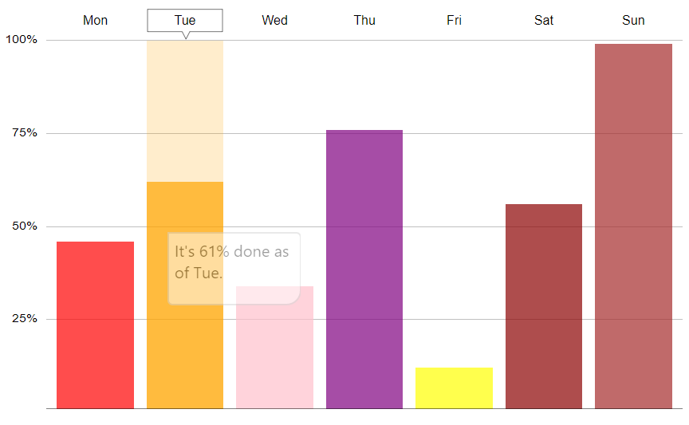

Meow-charts
----
An easy-to-use charting library for Svelte applications.

## How to use

Copy any `.svelte` components inside `/src` to your project.

## Column chart example

```html

<ColumnChart items={[45,61,33,75,11,55,98]}
             fill="blue"
             max="100"
             xLabels={["Mon","Tue","Wed","Thu","Fri","Sat","Sun"]}
             yLabels={["25%","50%","75%","100%"]} formatter={(x,y) => `It's ${y}% done as of ${x}.`}
columnColors={["red","orange","pink","purple","yellow","darkred","brown"]}
width="100%" height="100%"/>
```



## Line chart example

```html

<LineChart items="{[466,243,499,444,234,454,133,54,45,387]}" max="500"
           xLabels={[...Array(10).keys()].map(x => x*10+10)}
formatter={(x,y) => `It costs ${y}K$ after ${x} years.`}
yLabels={["100K","200K","300K","400K","500K"]} fill="darkblue"/>
```


## TODOS:

- Grouped/Stacked column chart.
- Radar/Polar chart.
- Combo chart.
- Bar chart.
